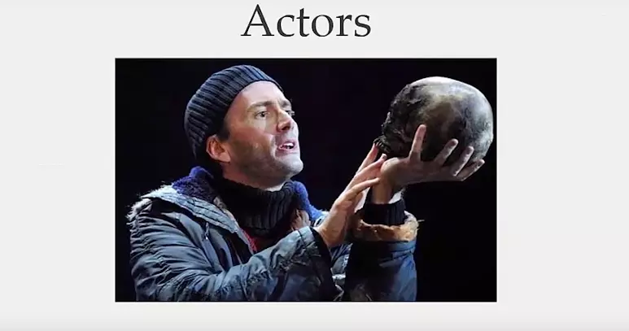

# Wechaty Actor

Wechaty Actor Model, Powered by XState, Mailbox, and CQRS

[](https://www.npmjs.com/package/wechaty-actor)
[](https://github.com/wechaty/actor/actions?query=workflow%3ANPM)
[](https://github.com/huan/mailbox#duckula-specification)
[](https://github.com/Chatie/tsconfig/issues/16)

Wechaty Actor is an wrapper for Wechaty
that applies the Actor Model with XState and CQRS.

## Actor Model



> The Actor Model is a computational model for designing concurrent, distributed systems around the principal of self-contained Actors which operate on sending and receiving messages.  
> &mdash; [Introduction to the Actor Model...](https://medium.com/xandr-tech/introduction-to-the-actor-model-for-concurrent-computation-56c0391f8f92)

## Features

1. Working with [wechaty-cqrs](https://github.com/wechaty/cqrs) by receiving the CQRS Commands and Queries, and responding Responses.
2. Implemented with [XState](https://xstate.js.org/) and [Mailbox](https://github.com/huan/mailbox)
3. Native designed for Domain Driven Design (DDD)

## Usage

### Install

```sh
npm install wechaty-actor wechaty-cqrs wechaty
```

### Quick start

Here's the Actor version of the Wechaty bot usage:

```ts
import * as ACTOR   from 'wechaty-actor'
import * as CQRS    from 'wechaty-cqrs'
import * as WECHATY from 'wechaty'

const wechaty = WECHATY.WechatyBuilder.build()
await wechaty.init()

const bus$ = CQRS.from(wechaty)
const actor = ACTOR.from(bus$)

actor.send(CQRS.commands.StartCommand(wechaty.puppet.id))
```

Learn how to build a Ding Dong BOT with Actor from our [examples/ding-dong-bot.ts](https://github.com/wechaty/actor/blob/main/examples/ding-dong-bot.ts)

## Getting Started

Here's a video introduction for CQRS Wechaty with live demo, presented by Huan:

To-be-recorded

The getting started [ding-dong-bot.ts](https://github.com/wechaty/getting-started/blob/main/examples/actor/ding-dong-bot.ts)
in the video: <https://github.com/wechaty/getting-started/blob/main/examples/actor/ding-dong-bot.ts>

## API Reference

Read Wechaty Actor API Reference at: <https://paka.dev/npm/wechaty-actor>

## Blogs

- [Refactoring Friday BOT with NestJS, Domain-driven Design (DDD), and CQRS, @huan, Feb 27, 2022](https://wechaty.js.org/2022/02/27/refactoring-friday-bot-with-nestjs-ddd-cqrs/)

## Resources

- [The actor model in 10 minutes](https://www.brianstorti.com/the-actor-model/)
- [Node.js actor framework](https://github.com/untu/comedy)
- [Beautiful State Machines](https://xstate-catalogue.com/) - XState Catalogue is a collection of professionally designed state machines you can drop into your projects. Get started by browsing the catalogue, interacting with the machines, and copying the code.
- [XState: Should this be an action or a service?](https://dev.to/mpocock1/xstate-should-this-be-an-action-or-a-service-2cp0)
- [Introduction to the Actor Model for Concurrent Computation, John Murray, Sep 29, 2015, Tech Talks @ AppNexus](https://www.youtube.com/watch?v=lPTqcecwkJg)
- [Kotlin Concurrency with Actors, Jag Saund, Jun 14, 2018](https://medium.com/@jagsaund/kotlin-concurrency-with-actors-34bd12531182)
- [Pure UI using Xstate and ReactJS](https://dev.to/cris_o/pure-ui-using-xstate-and-reactjs-5em7)

## History

### main

## v0.0.1 (May 8, 2022)

- v0.0.1 (Mar 6, 2022): Init README & Draft design from [bot5-assistant#1](https://github.com/wechaty/bot5-assistant/pull/1)

## Author

[Huan LI](http://linkedin.com/in/zixia) is a serial entrepreneur, active angel investor with strong technology background.
Huan is a widely recognized technical leader on conversational AI and open source cloud architectures.
He co-authored guide books "Chatbot 0 to 1" and "Concise Handbook of TensorFlow 2"
and has been recognized both by Microsoft and Google as MVP/GDE.
Huan is a Chatbot Architect and speaks regularly at technical conferences around the world.
Find out more about his work at <https://github.com/huan>

## Copyright & License

- Code & Docs © 2022 Huan (李卓桓) \<zixia@zixia.net\>
- Code released under the Apache-2.0 License
- Docs released under Creative Commons
